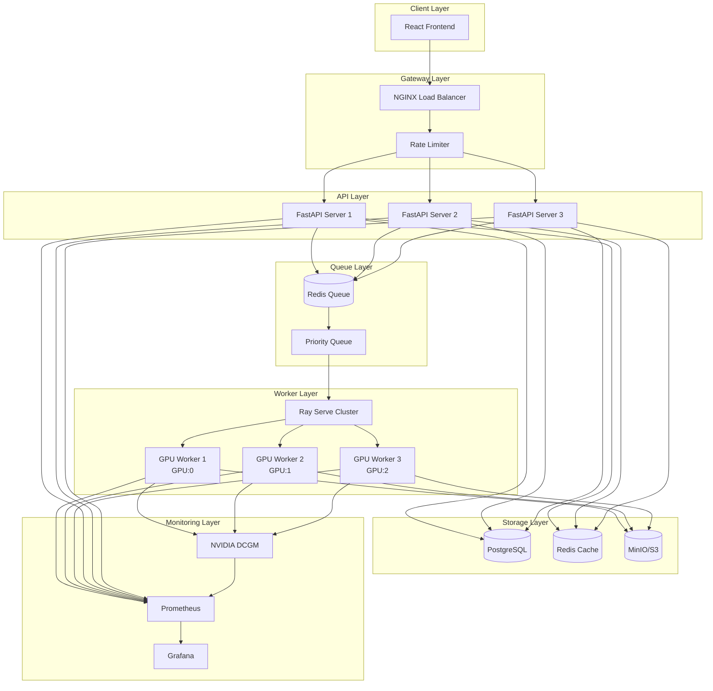
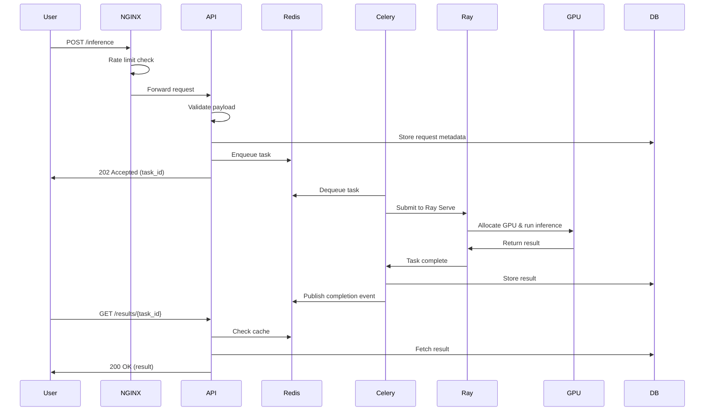

# AI Inference System Architecture

## Executive Summary

This document describes a production-ready architecture for a parallel AI inference system capable of handling thousands of concurrent requests across multiple GPUs. The system is designed for initial on-premise deployment with a seamless migration path to AWS.

**Key Capabilities:**
- ✅ Thousands of concurrent requests
- ✅ Multi-GPU load distribution
- ✅ Horizontal scalability
- ✅ Fault tolerance and automatic recovery
- ✅ Request prioritization
- ✅ Zero-downtime deployments
- ✅ AWS migration without code changes

---

## System Architecture Overview



---

## Technology Stack

### Frontend Layer

#### React 18 + TypeScript + Tailwind CSS

**Purpose**: User interface for submitting inference requests and viewing results.

**Key Features:**
- Type-safe development with TypeScript
- Responsive design with Tailwind CSS
- Real-time request status updates
- Request history and result caching

**Justification:**
- React provides excellent ecosystem and developer experience
- TypeScript prevents runtime errors and improves code quality
- Tailwind enables rapid UI development with consistent design
- Large community and extensive documentation

**Dependencies:**
```json
{
  "react": "^18.2.0",
  "typescript": "^5.0.0",
  "tailwindcss": "^3.3.0",
  "@tanstack/react-query": "^5.0.0",
  "axios": "^1.6.0",
  "vite": "^5.0.0"
}
```

---

### Gateway Layer

#### NGINX

**Purpose**: Load balancing, SSL termination, rate limiting, and request routing.

**Configuration:**
- Round-robin load balancing across API servers
- Connection pooling and keep-alive
- Request buffering for slow clients
- SSL/TLS termination
- Rate limiting: 1000 req/s per IP

**Justification:**
- Industry-standard reverse proxy with proven performance
- Handles 10,000+ concurrent connections efficiently
- Built-in rate limiting and DDoS protection
- Easy migration to AWS ALB + API Gateway

**AWS Equivalent**: Application Load Balancer (ALB) + API Gateway

---

### API Layer

#### FastAPI (Python 3.11+)

**Purpose**: REST API for request validation, authentication, and task queuing.

**Key Features:**
- Async request handling (asyncio)
- Automatic OpenAPI documentation
- Pydantic validation
- JWT authentication
- Request/response logging
- Health check endpoints

**Justification:**
- Native async support prevents blocking
- Automatic validation reduces errors
- Python aligns with ML/AI ecosystem
- Excellent performance (comparable to Node.js)
- Type hints improve code quality

**Performance:**
- Handles 1000+ req/s per instance
- Sub-10ms latency for request queuing
- Horizontal scaling with multiple workers

**Dependencies:**
```python
fastapi==0.109.0
uvicorn[standard]==0.27.0
pydantic==2.5.0
celery==5.3.4
redis==5.0.1
asyncpg==0.29.0
python-jose[cryptography]==3.3.0
```

---

### Message Queue

#### Redis Streams + Celery

**Purpose**: Distributed task queue for GPU job distribution.

**Architecture:**
- **Redis Streams**: Persistent message queue
- **Celery**: Task distribution and worker management
- **Priority Queues**: High/Normal/Low priority levels
- **Dead Letter Queue**: Failed task handling

**Features:**
- At-least-once delivery guarantee
- Task retry with exponential backoff
- Task result storage (24-hour TTL)
- Queue depth monitoring
- Consumer groups for parallel processing

**Justification:**
- Redis Streams provides persistence and reliability
- Celery is mature and battle-tested
- Simple setup compared to Kafka/RabbitMQ
- Excellent Python integration
- Easy migration to AWS SQS + ElastiCache

**Alternative**: RabbitMQ for more complex routing scenarios

**AWS Equivalent**: Amazon SQS + ElastiCache Redis

---

### GPU Worker Pool

#### Ray Serve

**Purpose**: GPU-accelerated inference with dynamic batching and load balancing.

**Architecture:**
- Ray cluster with GPU nodes
- Dynamic batching (configurable batch size)
- Automatic GPU allocation
- Model versioning and A/B testing
- Graceful deployment updates

**Key Features:**
- **Dynamic Batching**: Automatically batches requests for throughput
- **Multi-GPU Support**: Distributes load across available GPUs
- **Auto-scaling**: Scales workers based on queue depth
- **Model Caching**: Keeps models in GPU memory
- **Fault Tolerance**: Automatic worker restart on failure

**GPU Allocation Strategy:**
```python
# Ray automatically assigns GPUs
@serve.deployment(
    num_replicas=3,
    ray_actor_options={"num_gpus": 1}
)
class ModelDeployment:
    def __init__(self):
        # Ray sets CUDA_VISIBLE_DEVICES automatically
        self.model = load_model()
```

**Justification:**
- Best-in-class for custom model serving
- Native Python integration
- Excellent documentation and community
- Supports any ML framework (PyTorch, TensorFlow, JAX)
- Production-ready with Anyscale support

**Alternative Options:**
- **Triton Inference Server**: Better for standardized model formats (ONNX, TensorRT)
- **vLLM**: Optimal specifically for LLM inference with PagedAttention

**AWS Equivalent**: Same Ray Serve on EC2 GPU instances (P3, P4, G5)

---

### Orchestration

#### Docker + Kubernetes

**Development**: Docker Compose
**Production**: Kubernetes (on-premise) → Amazon EKS (AWS)

**Kubernetes Resources:**
- **Deployments**: API servers, workers
- **StatefulSets**: Redis, PostgreSQL
- **Services**: Internal load balancing
- **Ingress**: External traffic routing
- **HPA**: Horizontal Pod Autoscaler
- **PVC**: Persistent storage

**Justification:**
- Docker provides consistent environments
- Kubernetes offers production-grade orchestration
- Auto-scaling and self-healing
- Rolling updates with zero downtime
- Direct migration to AWS EKS

**AWS Migration**: `kubectl apply` works identically on EKS

---

### Storage Layer

#### PostgreSQL

**Purpose**: Transactional data storage.

**Schema:**
- `users`: User accounts and authentication
- `requests`: Inference request metadata
- `results`: Inference results (with S3 references)
- `models`: Model versions and configurations
- `audit_logs`: System audit trail

**Justification:**
- ACID compliance for critical data
- Excellent performance for transactional workloads
- Rich query capabilities
- Proven reliability

**AWS Equivalent**: Amazon RDS PostgreSQL

---

#### Redis

**Purpose**: Caching and session management.

**Use Cases:**
- API response caching (5-minute TTL)
- Session storage
- Rate limiting counters
- Real-time metrics

**AWS Equivalent**: Amazon ElastiCache Redis

---

#### MinIO (S3-Compatible)

**Purpose**: Object storage for large files.

**Stored Objects:**
- Model weights and checkpoints
- Large inference results (images, videos)
- Request/response payloads
- Backup archives

**Justification:**
- S3-compatible API
- Seamless migration to AWS S3
- High throughput for large files
- Built-in versioning

**AWS Equivalent**: Amazon S3 (zero code changes)

---

### Monitoring & Observability

#### Prometheus + Grafana

**Metrics Collected:**
- Request rate, latency, error rate (API)
- Queue depth and processing time
- GPU utilization, memory, temperature
- Model inference latency
- System resources (CPU, RAM, disk)

**Dashboards:**
- System overview
- API performance
- GPU utilization
- Queue health
- Cost analysis

**AWS Equivalent**: Amazon CloudWatch + Managed Grafana

---

#### NVIDIA DCGM

**Purpose**: GPU-specific monitoring.

**Metrics:**
- GPU utilization per device
- GPU memory usage
- Temperature and power consumption
- PCIe throughput
- ECC errors

**Integration**: Exports metrics to Prometheus

---

#### Loki (Log Aggregation)

**Purpose**: Centralized logging.

**Log Sources:**
- API server logs
- Worker logs
- NGINX access logs
- Kubernetes events

**Features:**
- Full-text search
- Log correlation with metrics
- Retention policies

**AWS Equivalent**: Amazon CloudWatch Logs

---

## Request Flow



**Flow Steps:**

1. **Request Submission** (< 10ms)
   - User submits request via frontend
   - NGINX performs rate limiting
   - API validates request schema
   - Task queued in Redis
   - User receives `task_id` immediately

2. **Task Processing** (variable, model-dependent)
   - Celery worker dequeues task
   - Ray Serve allocates GPU
   - Model performs inference
   - Result stored in DB + S3

3. **Result Retrieval**
   - User polls `/results/{task_id}`
   - API checks Redis cache first
   - Falls back to PostgreSQL
   - Returns result or status

**Alternative**: WebSocket for real-time updates (optional enhancement)

---

## GPU Allocation Strategy

### Ray Serve Automatic Allocation

Ray Serve manages GPU allocation automatically:

```python
@serve.deployment(
    num_replicas=3,  # 3 workers
    ray_actor_options={
        "num_gpus": 1,  # Each worker gets 1 GPU
        "num_cpus": 4   # 4 CPU cores per worker
    }
)
class InferenceModel:
    def __init__(self):
        # Ray sets CUDA_VISIBLE_DEVICES automatically
        import torch
        self.device = torch.device("cuda")
        self.model = load_model().to(self.device)
    
    async def __call__(self, request):
        # Inference runs on assigned GPU
        return await self.model.predict(request)
```

**Benefits:**
- No manual GPU assignment needed
- Automatic load balancing
- Fault tolerance (worker restart on failure)
- Dynamic scaling

---

### Manual GPU Assignment (Fallback)

For non-Ray deployments:

```python
# Worker 1: GPU 0
CUDA_VISIBLE_DEVICES=0 celery -A tasks worker --concurrency=1

# Worker 2: GPU 1
CUDA_VISIBLE_DEVICES=1 celery -A tasks worker --concurrency=1

# Worker 3: GPU 2
CUDA_VISIBLE_DEVICES=2 celery -A tasks worker --concurrency=1
```

---

### Dynamic Batching

Ray Serve automatically batches requests:

```python
@serve.deployment
class BatchedModel:
    @serve.batch(max_batch_size=32, batch_wait_timeout_s=0.1)
    async def handle_batch(self, requests):
        # Process batch of up to 32 requests
        batch_input = [r.data for r in requests]
        batch_output = self.model(batch_input)
        return batch_output
```

**Benefits:**
- 5-10x throughput improvement
- Optimal GPU utilization
- Automatic batch size tuning

---

## Scalability & Performance

### Horizontal Scaling

**API Layer:**
- Add more FastAPI replicas (stateless)
- NGINX distributes load automatically
- Target: 1000 req/s per instance

**Worker Layer:**
- Add more GPU nodes to Ray cluster
- Ray automatically distributes workload
- Linear scaling with GPU count

**Kubernetes HPA:**
```yaml
apiVersion: autoscaling/v2
kind: HorizontalPodAutoscaler
metadata:
  name: api-hpa
spec:
  scaleTargetRef:
    apiVersion: apps/v1
    kind: Deployment
    name: api-server
  minReplicas: 3
  maxReplicas: 10
  metrics:
  - type: Resource
    resource:
      name: cpu
      target:
        type: Utilization
        averageUtilization: 70
  - type: Pods
    pods:
      metric:
        name: queue_depth
      target:
        type: AverageValue
        averageValue: "100"
```

---

### Performance Targets

| Component | Metric | Target |
|-----------|--------|--------|
| API Latency | p50 | < 10ms |
| API Latency | p99 | < 50ms |
| Queue Latency | Average | < 100ms |
| Inference Latency | Model-dependent | Variable |
| GPU Utilization | Average | > 80% |
| Throughput | Requests/sec | 1000+ |
| Availability | Uptime | 99.9% |

---

### Fault Tolerance

**Request Retry Logic:**
- Client: 3 retries with exponential backoff
- API: Circuit breaker pattern
- Worker: Automatic task retry (max 3 attempts)

**Health Checks:**
- API: `/health` endpoint (every 10s)
- Workers: Ray health monitoring
- Database: Connection pool health

**Failure Scenarios:**

| Failure | Detection | Recovery |
|---------|-----------|----------|
| API crash | Health check | Kubernetes restarts pod |
| Worker crash | Ray monitor | Ray restarts actor |
| GPU hang | Timeout | Kill worker, restart |
| Queue full | Depth metric | Scale workers, reject requests |
| DB connection loss | Connection pool | Reconnect with backoff |

---

### Timeout Handling

```python
# Client timeout
response = requests.post(
    "/inference",
    json=payload,
    timeout=30  # 30s client timeout
)

# API timeout
@app.post("/inference")
async def inference(request: Request):
    try:
        result = await asyncio.wait_for(
            process_request(request),
            timeout=60  # 60s API timeout
        )
    except asyncio.TimeoutError:
        raise HTTPException(status_code=504, detail="Gateway timeout")

# Worker timeout
@celery.task(time_limit=120, soft_time_limit=110)
def inference_task(data):
    # 120s hard limit, 110s soft limit
    return model.predict(data)
```

---

## Security Considerations

### Authentication & Authorization

- **JWT tokens** for API authentication
- **API keys** for service-to-service communication
- **Role-based access control** (RBAC)
- **Rate limiting** per user/API key

### Network Security

- **TLS/SSL** for all external communication
- **Private networks** for internal services
- **Firewall rules** restricting GPU worker access
- **VPC** isolation in AWS

### Data Security

- **Encryption at rest** (database, S3)
- **Encryption in transit** (TLS)
- **PII data handling** compliance
- **Audit logging** for all requests

### Secrets Management

- **On-premise**: HashiCorp Vault or Kubernetes Secrets
- **AWS**: AWS Secrets Manager

---

## Cost Optimization

### On-Premise

- **GPU Utilization**: Batch inference, dynamic batching
- **Auto-scaling**: Scale down during low traffic
- **Spot Instances**: Not applicable on-premise

### AWS

- **EC2 Spot Instances**: 70% cost savings for GPU workers
- **Reserved Instances**: 40% savings for baseline capacity
- **S3 Lifecycle Policies**: Archive old results to Glacier
- **CloudWatch Alarms**: Alert on cost anomalies

**Estimated AWS Costs** (1000 req/s, 4x P3.2xlarge):
- Compute: ~$12,000/month
- Storage: ~$500/month
- Data transfer: ~$1,000/month
- **Total**: ~$13,500/month

---

## Disaster Recovery

### Backup Strategy

- **Database**: Daily snapshots, 30-day retention
- **Redis**: AOF persistence, hourly snapshots
- **S3**: Versioning enabled, cross-region replication
- **Configuration**: Git repository

### Recovery Procedures

- **RTO** (Recovery Time Objective): < 1 hour
- **RPO** (Recovery Point Objective): < 1 hour
- **Automated failover** for database
- **Multi-AZ deployment** in AWS

---

## Migration Path to AWS

See [deployment.md](./deployment.md#aws-migration) for detailed migration guide.

**Summary:**
1. Deploy Kubernetes cluster on AWS EKS
2. Update connection strings (RDS, ElastiCache, S3)
3. Deploy same Docker images
4. Configure AWS-native monitoring
5. Cutover DNS

**Zero code changes required** ✅

---

## Next Steps

1. Review [deployment.md](./deployment.md) for setup instructions
2. Review code examples in `/backend` and `/frontend`
3. Review infrastructure configs in `/infrastructure`
4. Follow production checklist in [production-checklist.md](./production-checklist.md)
